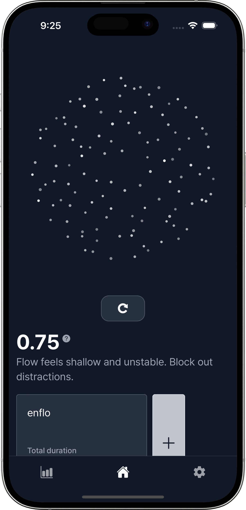

# enflo

**A timer app that visualizes your focus through entropy particles.**

Entropy is a measure of disorder; here it represents scattered focus.

Mental entropy (i.e. scattered focus) naturally increases—unless we deliberately lower it through deep immersion.  
But without feedback, it’s hard to know when that shift happens.  
enflo transforms that invisible process into an interactive particle visualization, guiding you from chaos to clarity.

## App Preview

> 🍎 Available on iOS: [App Store Link](https://apps.apple.com/app/enflo-visual-flow-timer/id6753640753)  
> 🤖 Android release is in progress and will be available soon.

  
  
  

  
  
  

## Why enflo?

Traditional timers measure _time_, not _quality_.  
Mental entropy—how scattered or stable your attention is—changes constantly.  
Yet we rarely get real feedback about it.

enflo turns that invisible process into something you can see and interact with,  
helping you notice **when and why** your focus drifts in real time.

## How it works

enflo bridges this gap by combining behavioral signals, visual feedback, and adaptive timing.  
Its system consists of:

- **Real-Time Entropy Visualization**: Animated particles represent concentration state (0–1).
- **Personalized Strategies**: Onboarding assessment and rhythm-based recommendations.
- **Flexible Timer**: 5–90 min sessions and auto-extension during deep focus.
- **Analytics Dashboard**: Weekly/monthly focus insights and AI-powered recommendations.

## Key Features

1. **Entropy Visualization**
   - Dynamic particle system tied to live entropy score.
   - Interactive touch & drag responses.

2. **Personalization**
   - Rhythm-based session suggestions based on past performance.
   - Collects detailed behavioral signals such as device shaking, app exits, and pause durations.
   - These signals dynamically influence the entropy score, providing a more accurate measure of focus quality.
   - Based on this data, enflo provides real-time, personalized strategies to help users stay in deep focus.

3. **Interventions**
   - Real-time alerts and suggestions to regain focus.
   - Preemptive guidance when approaching known low-focus times.

4. **Performance Analytics**
   - Track total and average focus times.
   - Visualize entropy trends and distraction patterns across sessions.
